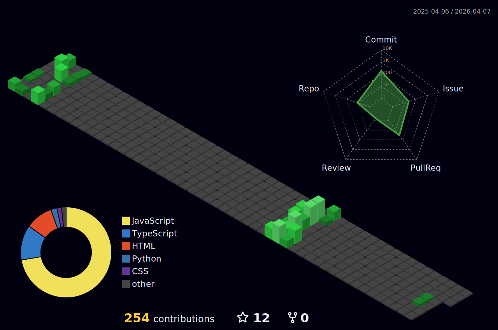

  
   
   
 

  

  
<a href="https://www.instagram.com/doncarderms/" target="_blank">
 <a href="https://www.linkedin.com/in/don-philocarderms-souffrant-3502b51b7/" target="_blank">
  

### Main skills:
&nbsp;
&nbsp;
&nbsp;
&nbsp; 

### Tools:

&nbsp;
<!-- &nbsp; -->
&nbsp;
&nbsp;

### Other Knowledge:
&nbsp;
&nbsp;

&nbsp;
  
### Studying in this moment:
&nbsp;

  

 
<b>Visitors Count</b>
  

 
 

 
 

****
