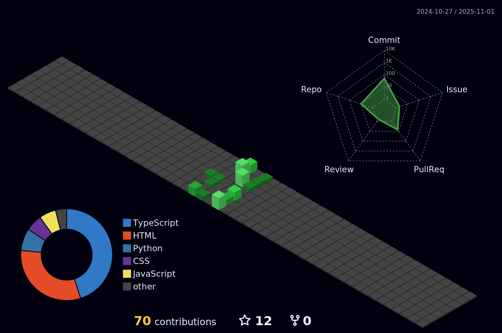

<h1 align="center">Hi 👋, I'm don philcarderms souffrant</h1>

### Connect with me:

### 📊 GitHub Stats: 

### Languages:
&nbsp; 

### Tools:

&nbsp;

&nbsp;

### Other Knowledge:

&nbsp;
  
### Studying in this moment:

###

<!-- 

  
  

 -->

  

 
<b>Visitors Count</b>
  

 
 

 
 
  
  
  
   
 

 

